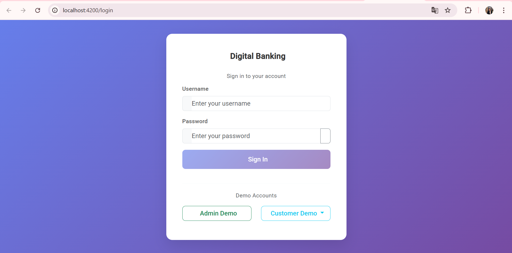
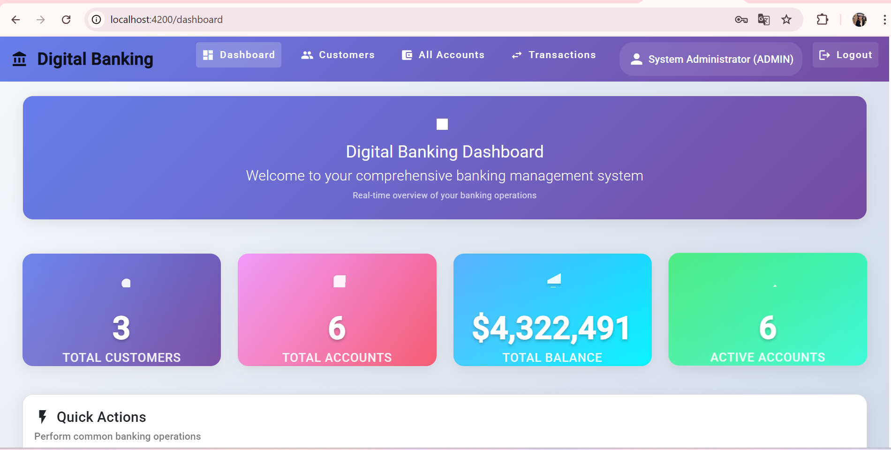
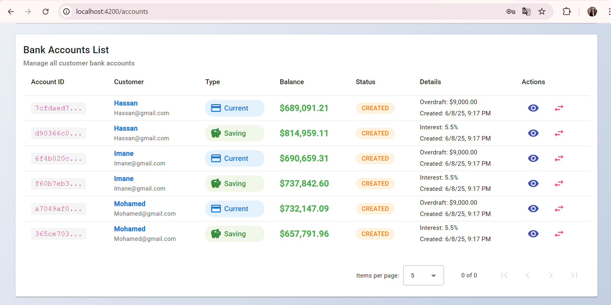
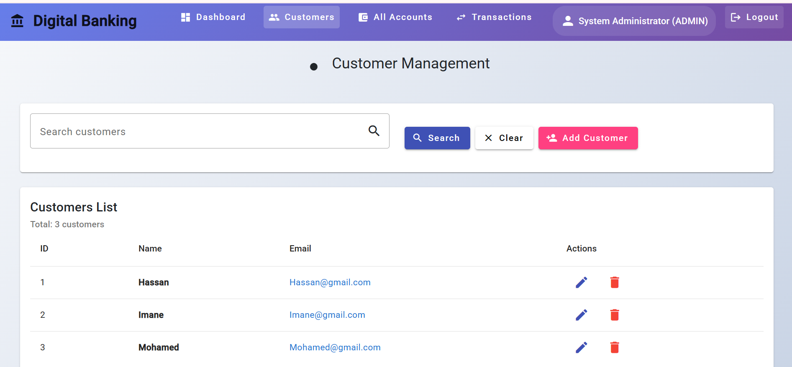
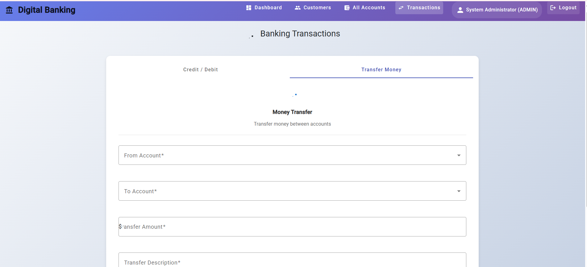

# 🏦 Digital Banking Application

## 📋 Table of Contents

- [Project Overview](#-project-overview)
- [Architecture](#-architecture)
- [Technology Stack](#-technology-stack)
- [Features](#-features)
- [Security Implementation](#-security-implementation)
- [Database Design](#-database-design)
- [Project Structure](#-project-structure)
- [Installation & Setup](#-installation--setup)
- [User Roles & Permissions](#-user-roles--permissions)
- [API Documentation](#-api-documentation)
- [Screenshots](#-screenshots)
- [Testing](#-testing)
- [Conclusion](#-conclusion)

## 🎯 Project Overview

The **Digital Banking Application** is a comprehensive full-stack web application that simulates real-world banking operations. Built with modern technologies, it provides secure authentication, role-based access control, and complete banking functionality including account management, transactions, and customer administration.

### 🎓 Academic Context

This project demonstrates advanced software engineering concepts including:

- **Full-Stack Development** with Spring Boot and Angular
- **Security Implementation** with JWT authentication
- **Database Design** with JPA/Hibernate
- **RESTful API Development** with proper HTTP methods
- **Role-Based Access Control** (RBAC)
- **Modern Frontend Development** with Angular Material
- **Professional Software Architecture** following best practices

## 🏗️ Architecture

The application follows a **3-tier architecture** pattern:

```
┌─────────────────────────────────────────────────────────────┐
│                    PRESENTATION LAYER                       │
│                   Angular Frontend                          │
│              (Components, Services, Guards)                 │
└─────────────────────────────────────────────────────────────┘
                              │
                              │ HTTP/REST API
                              │
┌─────────────────────────────────────────────────────────────┐
│                     BUSINESS LAYER                          │
│                   Spring Boot Backend                       │
│              (Controllers, Services, Security)              │
└─────────────────────────────────────────────────────────────┘
                              │
                              │ JPA/Hibernate
                              │
┌─────────────────────────────────────────────────────────────┐
│                      DATA LAYER                             │
│                    MySQL Database                           │
│                (Entities, Repositories)                     │
└─────────────────────────────────────────────────────────────┘
```

### 🔄 Communication Flow

1. **Frontend** sends HTTP requests with JWT tokens
2. **Security Filter** validates authentication and authorization
3. **Controllers** handle requests and delegate to services
4. **Services** implement business logic and interact with repositories
5. **Repositories** perform database operations
6. **Response** flows back through the layers to the frontend

## 💻 Technology Stack

### Backend Technologies

| Technology          | Version | Purpose                        |
| ------------------- | ------- | ------------------------------ |
| **Java**            | 17      | Programming Language           |
| **Spring Boot**     | 3.4.5   | Application Framework          |
| **Spring Security** | 6.x     | Authentication & Authorization |
| **Spring Data JPA** | 3.x     | Data Access Layer              |
| **Hibernate**       | 6.x     | ORM Framework                  |
| **MySQL**           | 8.0+    | Production Database            |
| **H2**              | 2.x     | Development Database           |
| **Maven**           | 3.6+    | Build Tool                     |
| **Lombok**          | 1.18+   | Code Generation                |

### Frontend Technologies

| Technology           | Version | Purpose              |
| -------------------- | ------- | -------------------- |
| **Angular**          | 17.0    | Frontend Framework   |
| **TypeScript**       | 5.2     | Programming Language |
| **Angular Material** | 17.0    | UI Component Library |
| **Bootstrap**        | 5.3     | CSS Framework        |
| **RxJS**             | 7.8     | Reactive Programming |
| **Angular CLI**      | 17.0    | Development Tools    |

### Development Tools

- **VSCode** - IDE with Java Extension Pack
- **Git** - Version Control
- **Postman** - API Testing
- **Chrome DevTools** - Frontend Debugging

## ✨ Features

### 🔐 Authentication & Authorization

- **JWT-based Authentication** with secure token management
- **Role-based Access Control** (Admin vs Customer)
- **Password Encryption** using BCrypt
- **Session Management** with automatic token refresh
- **Secure Login/Logout** functionality

### 👥 User Management

- **Admin Users** with full system access
- **Customer Users** with restricted access to their own data
- **User Registration** and profile management
- **Account linking** between users and customers

### 🏦 Banking Operations

- **Account Management**
  - Create Current and Savings accounts
  - View account details and balances
  - Account status management
- **Transaction Processing**
  - Credit operations (deposits)
  - Debit operations (withdrawals)
  - Transfer between accounts
  - Transaction history with pagination
- **Customer Management**
  - Customer registration and profiles
  - Search and filter customers
  - Link customers to user accounts

### 🎨 User Interface

- **Responsive Design** that works on all devices
- **Modern Material Design** with Angular Material
- **Professional Banking Theme** with gradient backgrounds
- **Interactive Components** with loading states and animations
- **Error Handling** with user-friendly messages
- **Role-based Navigation** showing different menus per user type

## 🔒 Security Implementation

### Authentication Flow

```
1. User submits credentials → Login Component
2. Credentials sent to → AuthController (/auth/login)
3. Spring Security validates → UserDetailsService
4. JWT token generated → JwtUtil
5. Token returned to → Frontend
6. Token stored in → localStorage
7. Subsequent requests → Include JWT in Authorization header
8. Backend validates → JwtAuthenticationFilter
9. Access granted/denied → Based on role and permissions
```

### Security Features

- **JWT Token Authentication** with custom implementation
- **Method-level Security** using `@PreAuthorize` annotations
- **CORS Configuration** for cross-origin requests
- **Password Encryption** with BCrypt (strength 12)
- **HTTP Security** with CSRF protection disabled for API
- **Role-based Endpoints** with different access levels

### Security Annotations Used

```java
@PreAuthorize("hasRole('ADMIN')")           // Admin only
@PreAuthorize("hasRole('CUSTOMER')")        // Customer only
@PreAuthorize("hasRole('ADMIN') or hasRole('CUSTOMER')") // Both roles
```

## 🗄️ Database Design

### Entity Relationship Diagram

```
┌─────────────┐    1:1     ┌─────────────┐    1:N     ┌─────────────┐
│    User     │◄──────────►│  Customer   │◄──────────►│ BankAccount │
├─────────────┤            ├─────────────┤            ├─────────────┤
│ id (PK)     │            │ id (PK)     │            │ id (PK)     │
│ username    │            │ name        │            │ balance     │
│ password    │            │ email       │            │ type        │
│ email       │            │ user_id(FK) │            │ status      │
│ fullName    │            └─────────────┘            │ customer_id │
│ role        │                                       └─────────────┘
│ enabled     │                                              │
└─────────────┘                                              │ 1:N
                                                             ▼
                                                    ┌─────────────┐
                                                    │AccountOper. │
                                                    ├─────────────┤
                                                    │ id (PK)     │
                                                    │ amount      │
                                                    │ type        │
                                                    │ date        │
                                                    │ description │
                                                    │ account_id  │
                                                    └─────────────┘
```

### Key Entities

#### User Entity

- **Purpose**: Authentication and authorization
- **Implements**: Spring Security's UserDetails interface
- **Relationships**: One-to-One with Customer
- **Security**: Stores encrypted passwords and roles

#### Customer Entity

- **Purpose**: Banking customer information
- **Relationships**: One-to-One with User, One-to-Many with BankAccount
- **Business Logic**: Represents bank customers

#### BankAccount Entity (Abstract)

- **Inheritance**: Table-per-class strategy
- **Subtypes**: CurrentAccount, SavingAccount
- **Relationships**: Many-to-One with Customer, One-to-Many with AccountOperation

#### AccountOperation Entity

- **Purpose**: Transaction records
- **Types**: DEBIT, CREDIT, TRANSFER
- **Audit**: Tracks all account activities

## 📁 Project Structure

### Backend Structure

```
src/main/java/ma/enset/digitalbanking/
├── 📁 config/                    # Configuration classes
│   ├── SecurityConfig.java       # Spring Security configuration
│   ├── JwtAuthenticationFilter.java # JWT filter
│   └── JwtUtil.java              # JWT utility methods
├── 📁 Entities/                  # JPA entities
│   ├── User.java                 # User authentication entity
│   ├── Customer.java             # Customer business entity
│   ├── BankAccount.java          # Abstract account entity
│   ├── CurrentAccount.java       # Current account implementation
│   ├── SavingAccount.java        # Savings account implementation
│   └── AccountOperation.java     # Transaction entity
├── 📁 repositories/              # Data access layer
│   ├── UserRepository.java       # User data operations
│   ├── CustomerRepository.java   # Customer data operations
│   ├── BankAccountRepository.java # Account data operations
│   └── AccountOperationRepository.java # Transaction data operations
├── 📁 services/                  # Business logic layer
│   ├── AuthenticationService.java # Authentication business logic
│   ├── BankAccountService.java   # Banking business logic
│   ├── BankAccountServiceImpl.java # Banking implementation
│   └── UserDetailsServiceImpl.java # Spring Security integration
├── 📁 web/                       # REST controllers
│   ├── AuthController.java       # Authentication endpoints
│   ├── BankAccountRestAPI.java   # Banking endpoints
│   └── CustomerRestController.java # Customer endpoints
├── 📁 dtos/                      # Data Transfer Objects
│   ├── LoginRequest.java         # Login request DTO
│   ├── LoginResponse.java        # Login response DTO
│   ├── BankAccountDTO.java       # Account DTO
│   └── TransferRequestDTO.java   # Transfer request DTO
├── 📁 enums/                     # Enumerations
│   ├── Role.java                 # User roles (ADMIN, CUSTOMER)
│   ├── AccountStatus.java        # Account status
│   └── OperationType.java        # Transaction types
├── 📁 exceptions/                # Custom exceptions
│   ├── BankAccountNotFoundException.java
│   ├── BalanceNotSufficientException.java
│   └── CustomerNotFoundException.java
└── DigitalBankingApplication.java # Main application class
```

### Frontend Structure

```
frontend/src/app/
├── 📁 components/                # Angular components
│   ├── 📁 login/                 # Login component
│   ├── 📁 navigation/            # Navigation component
│   ├── 📁 dashboard/             # Dashboard component
│   ├── 📁 account-list/          # Account list component
│   ├── 📁 account-details/       # Account details component
│   ├── 📁 customer-list/         # Customer list component
│   ├── 📁 customer-form/         # Customer form component
│   └── 📁 transaction-form/      # Transaction form component
├── 📁 services/                  # Angular services
│   ├── auth.service.ts           # Authentication service
│   ├── bank-account.service.ts   # Banking operations service
│   └── customer.service.ts       # Customer management service
├── 📁 models/                    # TypeScript models
│   └── customer.model.ts         # Data models
├── 📁 interceptors/              # HTTP interceptors
│   ├── http-request.interceptor.ts # JWT token interceptor
│   └── http-error.interceptor.ts # Error handling interceptor
├── 📁 guards/                    # Route guards
│   └── auth.guard.ts             # Authentication guard
└── app-routing.module.ts         # Application routing
```

## 🚀 Installation & Setup

### Prerequisites

- **Java 17+** (JDK)
- **Node.js 18+** and npm
- **MySQL 8.0+** (for production)
- **Git** for version control
- **VSCode** with Java Extension Pack (recommended)

### Backend Setup

1. **Clone the repository**

   ```bash
   git clone <repository-url>
   cd digital-banking
   ```

2. **Configure MySQL Database** (Optional - H2 is default)

   ```sql
   CREATE DATABASE digital_banking;
   CREATE USER 'banking_user'@'localhost' IDENTIFIED BY 'banking_password';
   GRANT ALL PRIVILEGES ON digital_banking.* TO 'banking_user'@'localhost';
   FLUSH PRIVILEGES;
   ```

3. **Update application.properties** (if using MySQL)

   ```properties
   spring.profiles.active=mysql
   spring.datasource.url=jdbc:mysql://localhost:3306/digital_banking
   spring.datasource.username=banking_user
   spring.datasource.password=banking_password
   ```

4. **Run the backend**

   ```bash
   # Using Maven wrapper (recommended)
   ./mvnw spring-boot:run

   # Or using Maven directly
   mvn spring-boot:run
   ```

   The backend will start on: **http://localhost:8085**

### Frontend Setup

1. **Navigate to frontend directory**

   ```bash
   cd frontend
   ```

2. **Install dependencies**

   ```bash
   npm install
   ```

3. **Start the development server**

   ```bash
   ng serve
   # Or
   npm start
   ```

   The frontend will start on: **http://localhost:4200**

### Quick Start with H2 Database

For development and testing, the application uses H2 in-memory database by default:

- **H2 Console**: http://localhost:8085/h2-console
- **JDBC URL**: `jdbc:h2:mem:bank`
- **Username**: `sa`
- **Password**: (empty)

## 👥 User Roles & Permissions

### 🔑 Demo Accounts

The application comes with pre-configured demo accounts for testing:

#### Admin Account

- **Username**: `admin`
- **Password**: `admin123`
- **Role**: ADMIN
- **Permissions**: Full system access

#### Customer Accounts

| Username  | Password      | Role     | Customer ID |
| --------- | ------------- | -------- | ----------- |
| `hassan`  | `password123` | CUSTOMER | 1           |
| `imane`   | `password123` | CUSTOMER | 2           |
| `mohamed` | `password123` | CUSTOMER | 3           |

### 🛡️ Permission Matrix

| Feature                 | Admin | Customer |
| ----------------------- | ----- | -------- |
| **Authentication**      |
| Login/Logout            | ✅    | ✅       |
| View Profile            | ✅    | ✅       |
| **Customer Management** |
| View All Customers      | ✅    | ❌       |
| Create Customer         | ✅    | ❌       |
| Edit Customer           | ✅    | ❌       |
| Delete Customer         | ✅    | ❌       |
| **Account Management**  |
| View All Accounts       | ✅    | ❌       |
| View Own Accounts       | ✅    | ✅       |
| Create Account          | ✅    | ❌       |
| **Transactions**        |
| View All Transactions   | ✅    | ❌       |
| View Own Transactions   | ✅    | ✅       |
| Perform Credit          | ✅    | ✅\*     |
| Perform Debit           | ✅    | ✅\*     |
| Transfer Money          | ✅    | ✅\*     |

\*Customers can only perform operations on their own accounts

### 🔐 Role-Based Endpoints

#### Admin-Only Endpoints

```
GET  /accounts                    # View all accounts
GET  /accounts/{id}               # View any account
GET  /accounts/{id}/operations    # View any account operations
GET  /customers                   # View all customers
POST /customers                   # Create customer
```

#### Customer Endpoints

```
GET  /accounts/my/{customerId}           # View own accounts
GET  /accounts/my/{accountId}/operations # View own account operations
```

#### Shared Endpoints (Both Roles)

```
POST /accounts/credit    # Credit operation
POST /accounts/debit     # Debit operation
POST /accounts/transfer  # Transfer operation
POST /auth/login         # Authentication
```

## 📡 API Documentation

### Authentication Endpoints

#### POST /auth/login

**Purpose**: Authenticate user and receive JWT token

**Request Body**:

```json
{
  "username": "admin",
  "password": "admin123"
}
```

**Response**:

```json
{
  "token": "eyJhbGciOiJIUzI1NiIsInR5cCI6IkpXVCJ9...",
  "username": "admin",
  "role": "ADMIN",
  "fullName": "System Administrator",
  "customerId": null
}
```

### Banking Endpoints

#### GET /accounts (Admin Only)

**Purpose**: Retrieve all bank accounts

**Headers**: `Authorization: Bearer <jwt-token>`

**Response**:

```json
[
  {
    "id": "acc-001",
    "balance": 15000.0,
    "type": "CurrentAccount",
    "status": "ACTIVATED",
    "customer": {
      "id": 1,
      "name": "Hassan",
      "email": "hassan@gmail.com"
    }
  }
]
```

#### GET /accounts/my/{customerId} (Customer)

**Purpose**: Retrieve customer's own accounts

**Response**: Same format as above, filtered by customer

#### POST /accounts/credit

**Purpose**: Credit money to an account

**Request Body**:

```json
{
  "accountId": "acc-001",
  "amount": 1000.0,
  "description": "Salary deposit"
}
```

#### POST /accounts/transfer

**Purpose**: Transfer money between accounts

**Request Body**:

```json
{
  "accountSource": "acc-001",
  "accountDestination": "acc-002",
  "amount": 500.0
}
```

### Error Responses

#### 401 Unauthorized

```json
{
  "timestamp": "2024-01-15T10:30:00",
  "status": 401,
  "error": "Unauthorized",
  "message": "Invalid credentials"
}
```

#### 403 Forbidden

```json
{
  "timestamp": "2024-01-15T10:30:00",
  "status": 403,
  "error": "Forbidden",
  "message": "Access denied"
}
```

## 📸 Screenshots

The following screenshots demonstrate the application's functionality and user interface:

### 🔐 Authentication System

#### Login Page


_Professional login interface with demo account shortcuts for easy testing_

### 👨‍💼 Admin Dashboard

#### Dashboard Overview


_Admin dashboard showing comprehensive banking overview and statistics_

#### Dashboard Extended View


_Extended dashboard view with additional banking metrics and controls_

#### All Accounts View (Admin Only)


_Admin can view all customer accounts with complete details and balances_

#### Customer Management


_Admin interface for managing customer information and profiles_

#### Add New Customer


_Customer creation form with validation and user-friendly interface_

### 👤 Customer Experience

#### Customer Accounts View


_Customer can only view their own accounts with restricted access_

### 💰 Banking Operations

#### Credit & Debit Operations


_Banking transaction interface for credit and debit operations with real-time balance updates_

#### Money Transfer


_Secure money transfer between accounts with validation and confirmation_

### 🔒 Security & Access Control

The application demonstrates robust security features:

- **Role-based Navigation**: Different menu items based on user role
- **JWT Authentication**: Secure token-based authentication system
- **Access Control**: Customers can only access their own data
- **Real-time Validation**: Immediate feedback on all operations

## 🧪 Testing

### Manual Testing Scenarios

#### Authentication Testing

1. **Valid Login**: Test with demo accounts
2. **Invalid Login**: Test with wrong credentials
3. **Token Expiration**: Test automatic logout
4. **Role Switching**: Login as different user types

#### Banking Operations Testing

1. **Account Viewing**:
   - Admin: Can see all accounts
   - Customer: Can only see own accounts
2. **Transactions**:
   - Credit operations with balance updates
   - Debit operations with insufficient funds handling
   - Transfer operations between accounts
3. **Data Persistence**: Verify data is saved correctly

#### Security Testing

1. **Unauthorized Access**: Try accessing admin endpoints as customer
2. **JWT Validation**: Test with invalid/expired tokens
3. **CORS**: Test cross-origin requests
4. **Input Validation**: Test with invalid data

### API Testing with Postman

#### Test Collection Structure

```
Digital Banking API Tests/
├── 📁 Authentication
│   ├── Admin Login
│   ├── Customer Login
│   └── Invalid Login
├── 📁 Admin Operations
│   ├── Get All Accounts
│   ├── Get All Customers
│   └── View Any Account Details
├── 📁 Customer Operations
│   ├── Get My Accounts
│   ├── View My Transactions
│   └── Unauthorized Access Test
└── 📁 Banking Transactions
    ├── Credit Account
    ├── Debit Account
    └── Transfer Money
```

### Sample Test Results

#### Successful Admin Login

```bash
POST http://localhost:8085/auth/login
Status: 200 OK
Response Time: 245ms
```

#### Customer Unauthorized Access

```bash
GET http://localhost:8085/accounts
Status: 403 Forbidden
Response Time: 12ms
```

#### Successful Transaction

```bash
POST http://localhost:8085/accounts/credit
Status: 200 OK
Balance Updated: ✅
```

## 🎯 Conclusion

### 🏆 Project Achievements

This Digital Banking Application successfully demonstrates:

1. **Full-Stack Development Mastery**

   - Complete integration between Spring Boot backend and Angular frontend
   - Professional-grade architecture following industry best practices
   - Responsive and modern user interface design

2. **Advanced Security Implementation**

   - JWT-based authentication with role-based access control
   - Method-level security with Spring Security annotations
   - Secure password encryption and token management

3. **Real-World Banking Simulation**

   - Complete banking operations (credit, debit, transfer)
   - Account management with different account types
   - Transaction history and audit trails

4. **Professional Software Engineering**
   - Clean code architecture with separation of concerns
   - Comprehensive error handling and validation
   - RESTful API design with proper HTTP methods

### 📚 Learning Outcomes

Through this project, the following concepts were mastered:

- **Backend Development**: Spring Boot, Spring Security, JPA/Hibernate
- **Frontend Development**: Angular, TypeScript, Angular Material
- **Database Design**: Entity relationships, JPA annotations
- **Security**: JWT authentication, RBAC, password encryption
- **API Development**: RESTful services, HTTP interceptors
- **Full-Stack Integration**: Frontend-backend communication

### 🚀 Future Enhancements

Potential improvements for the application:

1. **Enhanced Security**

   - Two-factor authentication (2FA)
   - OAuth2 integration
   - Advanced fraud detection

2. **Additional Features**

   - Account statements and reports
   - Email notifications
   - Mobile application
   - Real-time notifications

3. **Performance Optimization**

   - Database indexing
   - Caching mechanisms
   - Load balancing

4. **DevOps Integration**
   - Docker containerization
   - CI/CD pipelines
   - Cloud deployment

### 💡 Technical Excellence

This project showcases:

- **Clean Architecture** with proper layering
- **Security Best Practices** with comprehensive authentication
- **Modern Development Stack** using latest technologies
- **Professional UI/UX** with responsive design
- **Comprehensive Testing** with multiple test scenarios

The Digital Banking Application serves as an excellent demonstration of modern full-stack development capabilities, combining robust backend services with an intuitive frontend interface, all secured with enterprise-grade authentication and authorization mechanisms.

---

**Developed with ❤️ using Spring Boot & Angular**
_A comprehensive demonstration of modern full-stack development_
